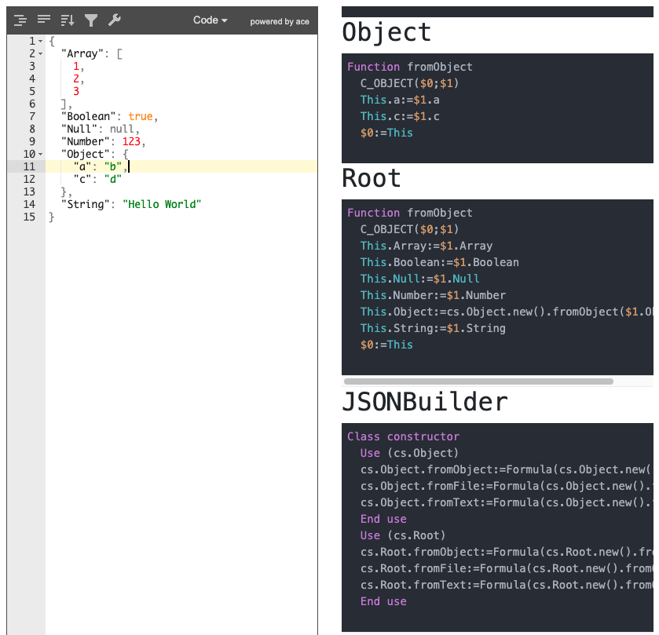

# JSONToClassesWebService

This web service accessible by default using url http://localhost:8702/classes/

Allow you to paste JSON code and see classes code provided by [JSONToClasses](JSONToClasses.md) method.

