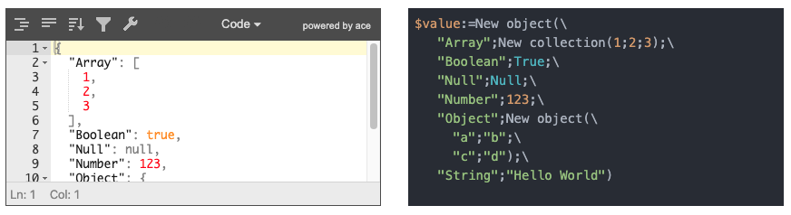

# JSONToCode
[![language][code-shield]][code-url] [![language-top][code-top]][code-url] ![code-size][code-size] [![release][release-shield]][release-url] [![license][license-shield]][license-url] [![discord][discord-shield]][discord-url]

Transform JSON to 4DCode.

## Usage

```4d
$codeString:=JSONToCode($jsonString)
```
[JSONToCode](Documentation/Methods/JSONToCode.md)

### Utilities

### Macro

A macro [MacroJSONToCode](Documentation/Methods/MacroJSONToCode.md) will convert your selected JSON text in your method editor, comment it, and paste the code.

If no selection, the pasteboard content will be used.

### WebServer

A component web server provide a page to edit your JSON and see the code immediatly



You could open this component and open the default URL http://localhost:8702

Or start the server yourself from a host database using  [JSONToCodeWebServer](Documentation/Methods/JSONToCodeWebServer.md)

💡 If you have javascript instead of JSON, you can use online service such as [convertonline.io](https://www.convertonline.io/convert/js-to-json)

### Pasteboard

Just call  [PBJSONToCode](Documentation/Methods/PBJSONToCode.md) and your pasteboard content will be converted

## 🚧 Convert JSON to class definition

Generate classes files with JSON data parsing

 [JSONToClasses](Documentation/Methods/JSONToClasses.md)

## Acknowledgment

- [JSON Editor](https://github.com/josdejong/jsoneditor) for web server
- Code syntax highlighting by [highlightjs](https://highlightjs.org/) with [4d addon](https://github.com/highlightjs/highlightjs-4d)

## Alternatives

- "Special Paste" in component full of macros [4DPop-Macros](https://github.com/vdelachaux/4DPop-Macros)

---

[](https://mesopelagique.github.io/)

<!-- MARKDOWN LINKS & IMAGES -->
<!-- https://www.markdownguide.org/basic-syntax/#reference-style-links -->
[code-shield]: https://img.shields.io/static/v1?label=language&message=4d&color=blue
[code-top]: https://img.shields.io/github/languages/top/mesopelagique/JSONToCode.svg
[code-size]: https://img.shields.io/github/languages/code-size/mesopelagique/JSONToCode.svg
[code-url]: https://developer.4d.com/
[release-shield]: https://img.shields.io/github/v/release/mesopelagique/JSONToCode
[release-url]: https://github.com/mesopelagique/JSONToCode/releases/latest
[license-shield]: https://img.shields.io/github/license/mesopelagique/JSONToCode
[license-url]: LICENSE.md
[discord-shield]: https://img.shields.io/badge/chat-discord-7289DA?logo=discord&style=flat
[discord-url]: https://discord.gg/dVTqZHr
